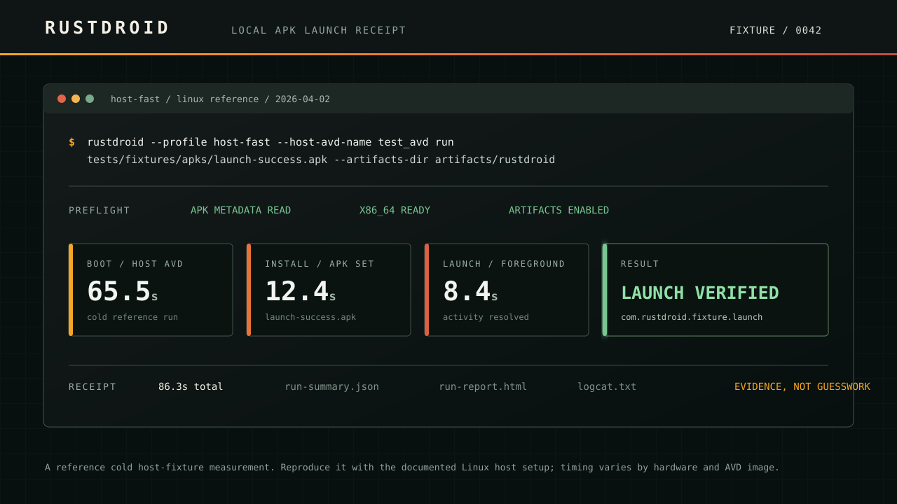

# RustDroid

<p align="center">
  
</p>

<p align="center">
  <strong>APK path in. Launch receipt out.</strong><br>
  A Linux-first CLI for booting an emulator, installing an APK, verifying its launch, and leaving evidence you can inspect or upload to CI.
</p>

<p align="center">
  <a href="docs/demo.md">See the reproducible demo</a> ·
  <a href="docs/first-install.md">Install on Linux</a> ·
  <a href="docs/support-matrix.md">Support matrix</a>
</p>

RustDroid is for the local step before a device cloud: the moment you need to know whether an APK, split APK, `.apks`, or `.xapk` will boot, install, launch, or leave a useful failure trail. It is intentionally narrower than a device farm and faster to reason about than manually wiring the Android emulator, ADB, logs, and cleanup every time.

## What a successful run proves

```text
APK path -> preflight -> boot or reuse -> install -> launch -> logs + receipt
```

`rustdroid run` does more than start an emulator. It inspects the APK, resolves the package/activity, waits for the launch path, streams logs, and can write a versioned `run-summary.json`, `run-report.html`, `junit.xml`, `run-summary.md`, and `logcat.txt`. A failed run should leave enough context to distinguish emulator, ADB, install, launch, and log-capture problems.

The image above is a recorded cold host-fixture reference run from April 2, 2026. Its timings are reproducible context, not a promise for every host; see the [demo receipt](docs/demo.md) and [performance notes](docs/performance-notes/v0.1.0.md).

## Start with the path you have

### I already have an APK

```bash
rustdroid \
  --profile host-fast \
  --host-avd-name test_avd \
  run path/to/app-debug.apk \
  --duration-secs 2 \
  --keep-alive false \
  --artifacts-dir artifacts/rustdroid
```

### I build with Gradle

```bash
./gradlew assembleDebug

rustdroid \
  --profile host-fast \
  --host-avd-name test_avd \
  run app/build/outputs/apk/debug/app-debug.apk \
  --duration-secs 2 \
  --keep-alive false \
  --artifacts-dir artifacts/rustdroid
```

### I need a CI-ready receipt

```bash
rustdroid \
  --runtime-backend host \
  --host-avd-name test_avd \
  --headless true \
  run path/to/app-debug.apk \
  --duration-secs 2 \
  --keep-alive false \
  --artifacts-dir artifacts/rustdroid
```

Upload `artifacts/rustdroid/` from the job that runs this command. The [CI guide](docs/ci-examples.md) explains the hosted Linux/KVM shape, and the [reusable GitHub Action](docs/github-action.md) packages the same receipt contract for workflows.

## Install

The prebuilt release archive currently targets **x86_64 Linux**. ARM/aarch64 Linux is supported through a source build until it has an equally tested release archive.

```bash
bash <(curl -fsSL https://raw.githubusercontent.com/OthmaneBlial/rustdroid/main/install.sh)
```

The installer writes `rustdroid`, `rustdroid-run`, and shell completions. On a supported Linux host, verify the environment before your first run:

```bash
rustdroid version
rustdroid doctor
rustdroid self-test --backend host
```

For source-only installation:

```bash
./install.sh --source
```

Read the [first-install guide](docs/first-install.md) for KVM, Android SDK, AVD, ADB, APK inspection, and optional `scrcpy` setup.
The [Linux quickstart](docs/quickstart-linux.md) has Ubuntu/Debian and Fedora commands plus the verified fixture path; [configuration ownership](docs/configuration.md) explains checked-in project settings.

## Choose the right backend

| Use this | When you need | What it keeps out of the hot path |
| --- | --- | --- |
| **Host backend** | The fastest daily Android SDK emulator loop | Docker; pairs well with `scrcpy` or headless mode |
| **Docker backend** | A contained setup, browser, or VNC fallback | Direct host emulator ownership |
| **A device cloud** | Shared, remote, or broad device coverage | RustDroid is not a device farm |

The host backend is the default performance path. Docker remains useful for reproducibility and browser/VNC access, but it is not presented as the normal fast loop.

## What RustDroid handles

- Single APKs, split APK installs, `.apks`, and `.xapk` inputs.
- `open`, `install`, `launch`, `run`, `watch`, `logs`, `clear-data`, `uninstall`, and safe cleanup.
- Host and Docker runtimes, `scrcpy`, browser/VNC fallbacks, and headless execution.
- `doctor`, `self-test`, `devices`, `avds`, `bench`, profiles, config inheritance, JSON output, and shell completions.
- Artifact capture for run receipts, crash/ANR clues, and deterministic fixture-backed tests.

The first documented fixture requires no Android project:

```bash
rustdroid \
  --profile host-fast \
  --host-avd-name test_avd \
  run tests/fixtures/apks/launch-success.apk \
  --duration-secs 2 \
  --keep-alive false \
  --artifacts-dir artifacts/rustdroid-demo
```

## Daily commands

```bash
# Find problems before a run
rustdroid doctor
rustdroid avds

# Keep an emulator ready, then iterate on builds
rustdroid --profile host-fast --host-avd-name test_avd open
rustdroid watch build/outputs/apk/debug --duration-secs 2 --keep-alive true

# Work with an installed app
rustdroid launch --package com.example.app
rustdroid logs --package com.example.app --since-start
rustdroid clear-data --package com.example.app
rustdroid stop --all
```

Use `rustdroid --help` for the complete command surface and `rustdroid profile list --json` to inspect built-in profiles.

## Evidence and limits

RustDroid validates the APK loop; it does not prove that every screen or business flow in your app is correct. Pair it with your existing UI-test framework when needed. RustDroid does not offer iOS support, remote device-farm management, a general Android automation DSL, hidden telemetry, or paid hosting.

The deterministic fixture suite covers a launchable APK, a missing launcher, x86_64 and ARM-only metadata, and a split pair. The broader host integration and smoke matrix should be used on Linux with KVM; failure artifacts include the stage logs, ADB/KVM/AVD diagnostics, and a small classification file.

## Guides

- [Demo receipt](docs/demo.md)
- [First install](docs/first-install.md)
- [Linux quickstart](docs/quickstart-linux.md)
- [Configuration ownership](docs/configuration.md)
- [Host backend](docs/host-backend.md)
- [Support matrix](docs/support-matrix.md)
- [Troubleshooting](docs/troubleshooting.md)
- [CI examples](docs/ci-examples.md)
- [Reusable GitHub Action](docs/github-action.md)
- [Fixture testing](docs/fixture-testing.md)
- [Run receipt schema](docs/receipt-schema-v1.md)
- [Operation plans and dry runs](docs/operation-plans.md)
- [APK loop recipes](docs/recipes.md)
- [Stack-specific reference workflows](docs/reference-workflows.md)
- [Reproducible benchmarks](docs/benchmarking.md)
- [Package distribution](docs/package-distribution.md)
- [Release process](docs/release-process.md)
- [1.0 checklist](docs/1.0-checklist.md)
- [Versioning policy](docs/versioning-policy.md)
- [Support scope](docs/support-scope.md)
- [Changelog policy](docs/changelog-policy.md)
- [Community and contribution flow](docs/community.md)
- [Contributing](CONTRIBUTING.md)
- [Code of Conduct](CODE_OF_CONDUCT.md)
- [Security policy](SECURITY.md)
- [Support](SUPPORT.md)
- [Changelog](CHANGELOG.md)

## License

MIT. See [LICENSE](LICENSE).
